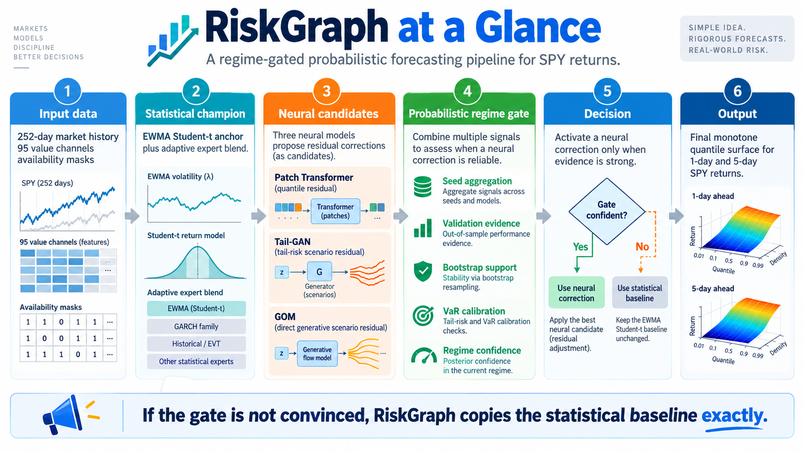
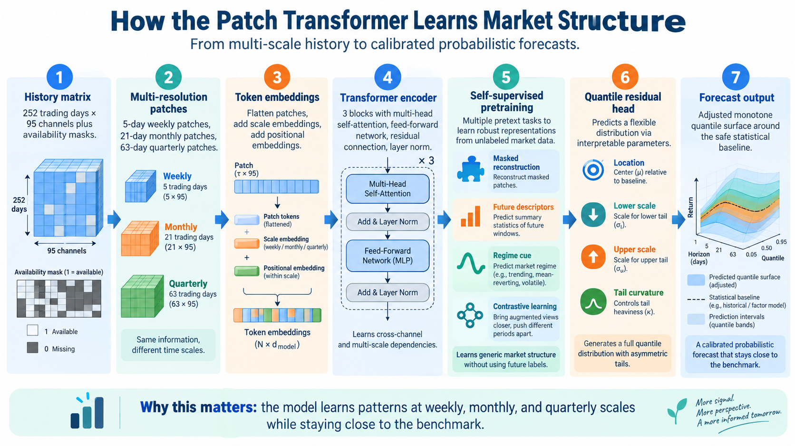
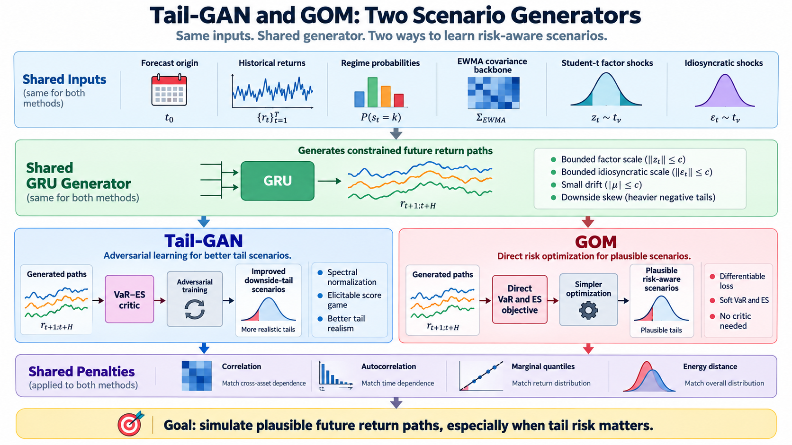

# RiskGraph: Regime-Gated Generative Models for Financial Forecasting

This project implements probabilistic frameworks to forecast SPY returns. It combines an EWMA Student-t statistical benchmark with three neural forecasting models: a self-supervised multi-resolution patch Transformer, a constrained Tail-GAN, and a Generative Objective Model (GOM). 
The models were implemented in Python 3.12 and PyTorch 2.5, with GPU acceleration for computationally intensive neural-network training and matrix operations.
Across three development folds (2020, 2022, and 2024), this project evaluates three neural-model families, each trained with three random seeds. This gives 27 development seed-model runs and nine ensemble-level promotion decisions. A separate final experiment evaluates the forecasting framework on the previously unseen 2025 holdout period.


## Key development results

| Development fold | Formal result | Relative reduction in mean pinball loss compared to Student-t EWMA |
|---|---|---:|
| Crisis 2020 | EWMA Student-t retained | 0.000% |
| Inflation 2022 | Stress-shrunk GOM | **+0.408%** |
| Inflation 2022 | Stabilized Tail-GAN | **+0.285%** |
| Recent 2024 | Stabilized Tail-GAN | **+0.203%** |

In the 2022 development fold, the GOM and Tail-GAN reduced mean pinball loss relative to the EWMA benchmark by 0.408% and 0.285%, respectively. Both models passed the predefined promotion criteria, and their reported 95% confidence intervals for average daily loss reduction remained positive.

In the 2024 development fold, Tail-GAN passed the pre-test promotion criteria and achieved a 0.203% reduction in mean pinball loss relative to EWMA.

The final experiment evaluates 226 previously unseen forecast origins in 2025, using models fitted on data through 2023 and promotion decisions determined exclusively from 2024 validation evidence.
The raw neural ensembles achieved reductions in mean pinball loss of 0.252% for the Transformer, 1.790% for Tail-GAN, and 1.770% for GOM relative to the EWMA baseline. 


<p align="center">
  
</p>

<p align="center">
  
</p>

<p align="center">
  
</p>


## Repository layout

```text
configs/    experiment configuration
scripts/    data, training, ensemble evaluation, comparison and verification
src/        reusable Python package
tests/     v1.7 regression and safety tests
 docs/      journal-format report and figures
```

## Installation

```bash
python -m venv .venv
source .venv/bin/activate          # Windows PowerShell: .venv\Scripts\Activate.ps1
python -m pip install --upgrade pip
python -m pip install -e .
```

## Research paper

For a detailed explanation of the forecasting architectures, mathematical formulations, training objectives, chronological evaluation protocol, regime-gating algorithm, empirical findings, and Value-at-Risk backtesting, please see the research paper:

- [Regime-Gated Generative Models for Probabilistic Financial Forecasting](docs/RiskGraph_Regime_Gated_Financial_Forecasting.pdf)

## Results and limitations

Please see [RESULTS.md](RESULTS.md) for a concise interpretation of accepted and rejected models. 

## Reproducibility and data

The repository provides implementation code, experiment configurations, evaluation scripts, and documentation for reconstructing the forecasting pipeline. Raw market data and trained model checkpoints are not distributed because of data-licensing restrictions. Please see [REPRODUCIBILITY.md](REPRODUCIBILITY.md) for data requirements, environment setup, and reproduction instructions.

## Skills demonstrated

- PyTorch model development and debugging
- generative modelling for financial scenarios
- Transformer-based time-series representation learning
- quantile forecasting and proper scoring rules
- chronological validation and model-selection safeguards
- bootstrap inference and VaR backtesting
- reproducible experiment orchestration and regression testing
