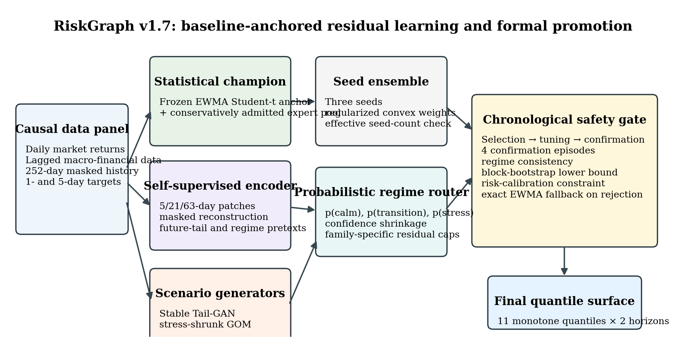
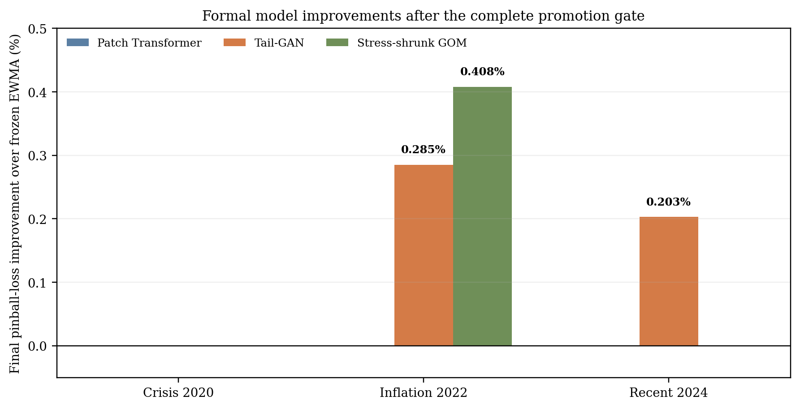

# RiskGraph: Regime-Gated Generative Models for Financial Forecasting

A research implementation for **probabilistic forecasting of SPY returns** using a frozen EWMA Student-t benchmark, a self-supervised patch Transformer, a stabilized Tail-GAN, and a stress-shrunk generative objective model (GOM).

The project is designed around a simple principle: a flexible model may modify the statistical forecast only when a chronological, pre-test gate supports the change. Rejected models revert exactly to the statistical benchmark.

<p align="center">
  
</p>

## Key development results

| Development fold | Formal result | Mean pinball improvement over frozen EWMA |
|---|---|---:|
| Crisis 2020 | EWMA Student-t retained | 0.000% |
| Inflation 2022 | Stress-shrunk GOM | **+0.408%** |
| Inflation 2022 | Stabilized Tail-GAN | **+0.285%** |
| Recent 2024 | Stabilized Tail-GAN | **+0.203%** |

The 2022 GOM and Tail-GAN common-origin loss-difference intervals were entirely favourable. The 2024 Tail-GAN passed the predeclared promotion gate, although its descriptive test interval included zero. The 2025 fold is not included in these development results.

<p align="center">
  
</p>

## Main technical ideas

- **Anchor-safe statistical champion:** a frozen EWMA Student-t forecast remains the baseline unless an adaptive heavy-tail expert pool passes disjoint chronological checks.
- **Target-relevant self-supervision:** 5-, 21-, and 63-day patch tokens are pretrained with masked-history, future-distribution, regime, and contrastive objectives.
- **Stable scenario generators:** Tail-GAN and GOM operate through bounded factor scale, idiosyncratic scale, drift, and downside-asymmetry controls.
- **Probabilistic regime routing:** residual corrections depend on causal calm, transition, and stress probabilities and are shrunk when regime confidence is low.
- **Formal promotion gate:** selection, tuning, confirmation episodes, circular block bootstrap, risk-calibration checks, and effective seed-count constraints.
- **Exact fallback:** rejected forecasts are serialized as exact copies of the benchmark quantile frame.

## Repository layout

```text
configs/    experiment configuration
scripts/    data, training, ensemble evaluation, comparison and verification
src/        reusable Python package
tests/     v1.7 regression and safety tests
 docs/      journal-format report and figures
```

## Installation

```bash
python -m venv .venv
source .venv/bin/activate          # Windows PowerShell: .venv\Scripts\Activate.ps1
python -m pip install --upgrade pip
python -m pip install -e .
```

The project was developed with Python 3.12 and PyTorch 2.5. GPU training is optional but strongly recommended for the full matrix.

## Software checks

```bash
python -m compileall -q src scripts tests
python -m pytest tests/test_performance_v170.py -q -p no:cacheprovider
python scripts/run_performance_v170_smoke.py --device cpu
```

## Development-fold experiment

Prepare the market panel using the data scripts and then run:

```bash
CONFIG=configs/financial_risk_graph_v170.yaml \
FOLDS=development \
TRAIN_DEVICE=auto \
EVAL_DEVICE=auto \
bash scripts/run_performance_v170_research.sh
```

Verify the completed matrix:

```bash
python scripts/verify_performance_v170.py \
  --config configs/financial_risk_graph_v170.yaml
```

The formal experiment comprises 27 supervised seed models and nine fold-family ensemble decisions.

## Research paper

The full methodology, equations, pseudocode, figures, gate design, horizon results and risk diagnostics are in:

- [Regime-Gated Generative Models for Probabilistic Financial Forecasting](docs/RiskGraph_Regime_Gated_Financial_Forecasting.pdf)

## Results and limitations

See [RESULTS.md](RESULTS.md) for a concise interpretation of accepted and rejected models. In particular, improved pinball loss did not eliminate clustered 5% VaR exceptions at the five-day horizon.

## Reproducibility and data

See [REPRODUCIBILITY.md](REPRODUCIBILITY.md). Raw market data, trained checkpoints, HPC logs, credentials and private file paths are intentionally excluded from the public repository.

## Skills demonstrated

- PyTorch model development and debugging
- generative modelling for financial scenarios
- Transformer-based time-series representation learning
- quantile forecasting and proper scoring rules
- chronological validation and model-selection safeguards
- block-bootstrap inference and VaR backtesting
- reproducible experiment orchestration and regression testing

## Publishing

A step-by-step employer-facing publication workflow is provided in [GITHUB_PUBLISHING.md](GITHUB_PUBLISHING.md).

## Citation

A machine-readable citation is provided in [CITATION.cff](CITATION.cff).
